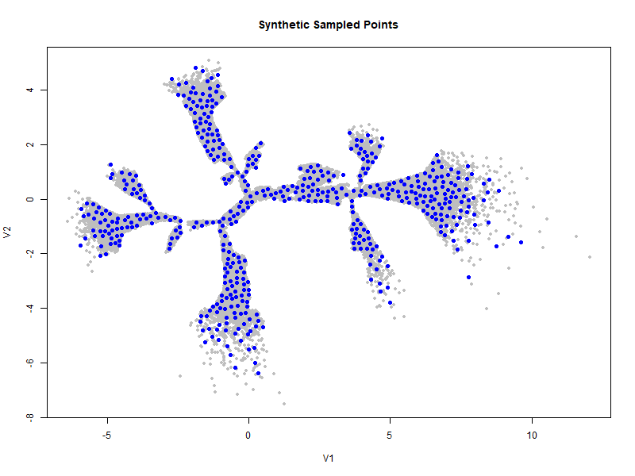

# 📦 Synthetic Dataset Generator Documentation

## 📁 Code Location

This function is implemented in the R script located at:

```
Z:\pi514\input_for_ddrtree_ukbb\ukbb_inputs_final\UKB_taxonomy_UI_synthetich_data_Generation
```

The primary script file generates a fully structured, synthetic dataset suitable for prototyping, visualization, and pipeline development in healthcare or taxonomic data systems.

---

## 📌 What the Function Does

The `generate_synthetic_dataset()` function:

1. **Loads a full dataset** with spatial (`V1`, `V2`) and clinical/demographic variables.
2. **Selects `sample_size` spatially diverse samples** from the dataset using a minimum Euclidean distance filter.
3. **Synthesizes feature values** for columns before the spatial coordinates using:
   - `rbinom()` for binary fields like `hypertension_BL`, `hyperchol_BL`, `diabetes_BL`, and `Sex`
   - Multinomial sampling from observed frequencies for `Ethnic_background`
   - Normal distribution sampling (`rnorm()`) for continuous variables
4. **Saves the synthetic dataset** to a user-specified output path.
5. **Creates and saves a visualization plot** of the spatial sampling result.

---

## 🔧 Key Parameters

| Parameter         | Description                                                    |
|------------------|----------------------------------------------------------------|
| `full_dataset_path` | Path to the input dataset CSV file                          |
| `output_path`        | Path where the synthetic CSV file will be saved           |
| `sample_size`        | Number of spatial points to sample (default: 500)         |
| `min_distance`       | Minimum distance between sampled points (default: 0.17)   |

---

## 📥 Inputs

The dataset must include:
- **Spatial columns**: `V1`, `V2`
- **Binary/categorical columns**: `hypertension_BL`, `hyperchol_BL`, `diabetes_BL`, `Sex`, `Ethnic_background`
- **Any number of continuous or additional metadata fields**

---

## 📤 Outputs

- **Synthetic CSV file** saved at `output_path`, with:
  - Synthetic values for all columns before `V1`
  - Original values preserved for all columns after `V2`
  - Matching column order with the full dataset

- **PNG plot file** saved in the same directory as `output_path`, showing:
  - Gray: all original spatial points
  - Blue: selected synthetic sample points

---

## 🧪 Example Configuration

```r
generate_synthetic_dataset(
  full_dataset_path = "Z:/pi514/input_for_ddrtree_ukbb\ukbb_inputs_final/UKB_taxonomy_UI_synthetich_data_Generation/Data_input.csv",
  output_path = "Z:/pi514/input_for_ddrtree_ukbb\ukbb_inputs_final/UKB_taxonomy_UI_synthetich_data_Generation/synthetic_dataset_Taxonomy.csv",
  sample_size = 500,
  min_distance = 0.17
)
```

This command will generate 500 spatially diverse, partially synthetic samples and export the results in both `.csv` and `.png` formats to the specified folder.

---

## 📊 Visual Output

The plot (`synthetic_plot.png`) provides a quick visual verification of:
- The full spatial distribution of the dataset
- The synthetic sample’s spread across the spatial domain




> *Figure: Distribution of generated synthetich dataset for 500 samples.*

---

## 🧠 Purpose & Applications

This tool is designed to:
- Enable **privacy-preserving data sharing**
- Simulate realistic input for **machine learning pipelines**
- Prototype interactive UIs (e.g., R Shiny apps) without exposing sensitive data
- Generate training/testing sets for taxonomic or medical analysis tools

---

